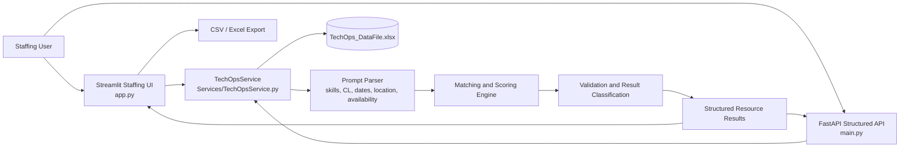
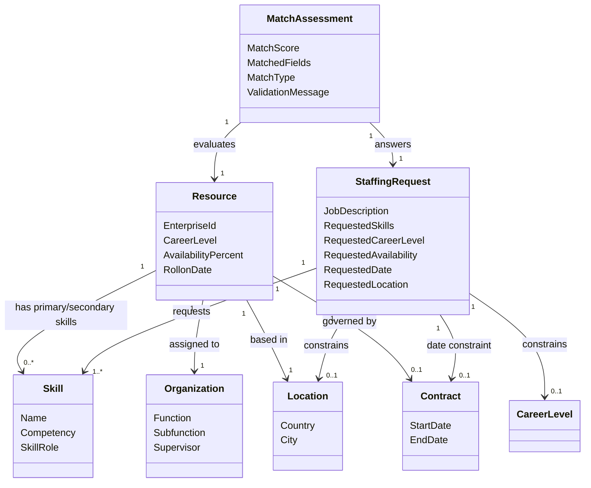

# PM Assistant Ontology Architecture

**Application:** PM Assistant - TechOps Staffing Search  
**Document version:** 1.0  
**Prepared:** 15 September 2026  
**Source of truth:** `Data/TechOps_DataFile.xlsx`

## 1. Purpose and scope

This document defines the logical ontology and application architecture for the
structured staffing-search experience. It describes:

- The business entities and concepts represented in the TechOps workbook.
- The relationships between resources, skills, organizational assignments,
  geography, availability, and contracts.
- How natural-language staffing requests are translated into structured search
  constraints.
- How the ontology maps to the Python service, Streamlit UI, and FastAPI
  endpoints.
- The result-ranking, exact-match, partial-match, and validation semantics.

The ontology is currently implemented as a logical domain model over a pandas
DataFrame. It is not persisted as an OWL/RDF knowledge graph.

## 2. High-level architecture



### Runtime responsibilities

| Layer | Responsibility | Current implementation |
|---|---|---|
| Presentation | Chat-style staffing interaction, metrics, history, result table, downloads | `app.py` |
| API | Programmatic structured search and schema discovery | `main.py` |
| Domain/service | Workbook loading, schema validation, parsing, filtering, scoring, serialization | `Services/TechOpsService.py` |
| Data | Resource records and staffing attributes | `Data/TechOps_DataFile.xlsx` |
| Export | Downloadable search result extracts | Streamlit CSV and Excel download buttons |

## 3. Ontology overview

The core ontology is organized around the **Resource** entity. A resource may
have one or more skills, belongs to an organizational context, is located in a
geography, has an availability state, and is governed by contract dates.



## 4. Domain concepts and data properties

### 4.1 Resource

**Definition:** A person who may be recommended for a staffing request.

| Ontology property | Workbook column | Meaning | Matching role |
|---|---|---|---|
| `resource.enterpriseId` | `EnterpriseId` | Unique enterprise identifier | Supports exact person lookup and result identity |
| `resource.careerLevel` | `CL` | Career level associated with the person | Required filter when CL is explicitly requested |
| `resource.availabilityPercent` | `Availability` | Percentage of capacity currently available | Current-availability filter |
| `resource.rollonDate` | `RollonDate` | Roll-on or assignment date | Returned as context; not currently a primary prompt filter |

### 4.2 Skill

Skills are represented in two role-specific properties:

| Ontology property | Workbook column | Meaning |
|---|---|---|
| `resource.primarySkill.name` | `Primary Skill` | Main skill or capability |
| `resource.primarySkill.competency` | `Primary Skill Competency` | Competency level or proficiency associated with the primary skill |
| `resource.secondarySkill.name` | `Secondary Skill` | Additional skill or capability |

Skill search is authoritative against `Primary Skill` and `Secondary Skill`.
The service normalizes punctuation and casing and also supports token overlap
for common naming variations such as `ASP .net MVC` and `ASP.NET MVC`.

Rows whose primary and secondary skill values are both blank, `N/A`,
`Not available`, `No Skill available`, or `No Skills available` are excluded
from staffing skill results.

### 4.3 Organization

| Ontology property | Workbook column | Meaning |
|---|---|---|
| `resource.organization.function` | `RDTFunction(RDT-1)` | Higher-level organizational function |
| `resource.organization.subfunction` | `RDTSubfunction(RDT-2)` | More specific organizational subfunction |
| `resource.organization.supervisor` | `Supervisor` | Supervisory relationship or reporting contact |

These attributes are returned in the result set. They are part of the resource
context but are not currently treated as primary natural-language filters by
the structured search contract.

### 4.4 Location

| Ontology property | Workbook column | Meaning |
|---|---|---|
| `resource.location.country` | `Country` | Country in which the resource is based |
| `resource.location.city` | `City` | City in which the resource is based |

Country and city are extracted from known workbook values and applied after
the skill and career-level candidate set has been established.

### 4.5 Contract and staffing dates

| Ontology property | Workbook column | Meaning |
|---|---|---|
| `resource.contract.startDate` | `ContractStartDate` | Start of the current contract or assignment |
| `resource.contract.endDate` | `ContractEndDate` | End of the current contract or assignment |

For a request such as “available after December 2026”, the current business
interpretation is that a resource becomes available after the existing
contract ends by the requested cutoff. The service therefore evaluates the
contract end date against the parsed date boundary. Explicit contract-start
and contract-end wording is supported.

### 4.6 Availability

Availability is a percentage capacity value:

| Value | Ontology meaning | Included by “currently available” |
|---:|---|---|
| `0` | No capacity available | No |
| `1-99` | Partially available | Yes, only when the current contract has ended |
| `100` | Fully available | Yes, only when the current contract has ended |
| Missing or invalid | Unknown; treated as unavailable | No |

Current availability requires both positive capacity and a contract end date
that is today or earlier. A resource with `Availability = 100` but an active
contract ending in the future is not considered currently available for a new
staffing request. This is separate from future contract-date availability. A
request such as “available after December 2026” evaluates the contract-date
rule instead of the current-availability rule.

## 5. Staffing request ontology

A natural-language request is represented as a `StaffingRequest` with the
following possible constraints:

```text
StaffingRequest
├── requestedSkills: one or more skill concepts
├── careerLevel:
│   ├── exact value, e.g. CL 8
│   └── relative operator, e.g. above/below a level
├── availability:
│   └── currently available / free / unallocated
├── contractDate:
│   ├── after/from/starting a date
│   └── before/until a date
├── location:
│   ├── country
│   └── city
└── resultLimit
```

The parser also detects exact enterprise IDs embedded in a prompt. An exact
enterprise-ID request takes precedence over broad skill discovery.

## 6. Query interpretation and matching rules

### 6.1 Candidate construction

The current search flow is:

1. Load and validate the required workbook columns.
2. Parse the prompt into normalized skills and structured filters.
3. If an enterprise ID is present, restrict candidates to that resource.
4. Otherwise, exclude rows with no usable skills.
5. Apply the requested career-level filter.
6. For skill requests, retain resources matching at least one requested skill
   in either primary or secondary skill.
7. Evaluate optional criteria: current availability, contract dates, country,
   and city.
8. Calculate match score and matched fields.
9. Return exact matches when all requested criteria are satisfied; otherwise
   return ranked partial matches with a validation message.

### 6.2 Multiple skills

For a request containing multiple skills:

- **Exact result:** all requested skills must be found in the resource's
  primary and/or secondary skill fields.
- **Partial result:** at least one requested skill must match, while an
  explicitly requested career level remains a fixed requirement.
- Optional criteria such as date, availability, city, and country contribute
  to ranking and exactness.

This implements the business rule:

```text
(Primary Skill OR Secondary Skill) AND Career Level
```

with other criteria evaluated as additional match dimensions.

### 6.3 Career-level semantics

An exact career-level request such as `CL 8` matches only level `8`.

Relative wording follows the application's configured career-level hierarchy:

- “career level above 8” selects numeric CL values lower than `8`.
- “career level below 8” selects numeric CL values higher than `8`.

This is intentionally different from ordinary numeric comparison because it
reflects the career-level hierarchy used by the staffing process.

### 6.4 Result classification

| Condition | Result behavior |
|---|---|
| All requested criteria match | Return exact ranked results without a warning |
| Skills and career level match, but optional criteria do not all match | Return partial matches and show `No resource found with all criteria. Below resources are matching partially.` |
| No eligible candidate remains | Show `Expected resource not available in TechOps` |
| No skill is requested | Treat the query as a general resource/availability query |

## 7. Match assessment model

Each result contains the workbook fields plus:

| Output property | Meaning |
|---|---|
| `MatchScore` | Integer score from 0 to 100 used to rank results |
| `MatchedFields` | Skill and optional criteria that matched |

For skill-oriented validation searches, the conceptual score is:

```text
Skill score    = up to 60 points based on requested skills matched
Optional score = up to 40 points based on optional criteria matched
Total          = Skill score + Optional score
```

The lower-level `search()` path also gives extra weighting to primary versus
secondary skill matches. Results are sorted by exactness, skill completeness,
score, and enterprise ID for deterministic output.

## 8. Technical ontology-to-code mapping

| Ontology capability | Code location |
|---|---|
| Workbook schema and required columns | `TECHOPS_COLUMNS` in `Services/TechOpsService.py` |
| Resource loading and schema validation | `TechOpsService.load_data()` |
| Data access for UI metrics | `TechOpsService.get_dataframe()` |
| Natural-language filter parsing | `TechOpsService._parse_prompt_filters()` |
| Skill discovery from prompt | `TechOpsService._requested_skills()` |
| Skill-to-resource matching | `TechOpsService._skill_matches_row()` |
| Unavailable-skill exclusion | `TechOpsService._has_unavailable_skill()` |
| Career-level filtering | `TechOpsService._apply_career_filter()` |
| Optional criteria evaluation | `TechOpsService._matched_optional_criteria()` |
| Exact/partial validation search | `TechOpsService.search_with_validation()` |
| General structured search | `TechOpsService.search()` |
| Result serialization | `TechOpsService._serialize_value()` |
| Chat UI and result presentation | `app.py` |
| API request/response contract | `main.py` |

## 9. External interfaces

### Streamlit UI

The UI provides:

- Staffing-themed dashboard metrics.
- Natural-language chat input.
- Last-10-question history.
- Ranked result table.
- Validation messages for exact versus partial results.
- CSV and Excel downloads.
- Workbook filename and last-updated timestamp in the sidebar.

### FastAPI

| Endpoint | Purpose |
|---|---|
| `GET /resources/columns` | Returns the structured workbook schema |
| `POST /resources/search` | Searches resources using job description and optional filters |
| `GET /resources` | Lists resources with optional country, city, availability, and limit filters |

`POST /resources/search` accepts:

```json
{
  "job_description": "AWS data platform",
  "primary_skill": null,
  "secondary_skill": null,
  "career_level": "9",
  "country": "United Kingdom",
  "city": null,
  "available_only": true,
  "limit": 10
}
```

## 10. Data quality and governance rules

1. The workbook must contain every column in `TECHOPS_COLUMNS`.
2. The service fails explicitly when the workbook is missing or has an
   incomplete schema.
3. Empty values are normalized for consistent matching and serialization.
4. Invalid or missing availability does not count as available.
5. Skill-free resources are not returned for skill-based searches.
6. Date values are serialized as ISO dates in API/UI result records.
7. Search results remain grounded in the workbook; no generic answer mode is
   used for staffing recommendations.

## 11. Recommended future ontology enhancements

The current logical ontology can evolve without changing the core Resource
model:

- Introduce a controlled `Skill` vocabulary with aliases and canonical IDs.
- Model `PrimarySkill` and `SecondarySkill` as explicit relationships rather
  than two denormalized columns.
- Add a first-class `AvailabilityWindow` entity for future capacity planning.
- Distinguish current assignment, contract, and roll-on events.
- Add normalized `Country` and `City` reference entities.
- Persist parsed staffing requests and match assessments for auditability.
- Add an ontology-backed explanation object describing why each resource was
  included, excluded, or partially matched.
- Add automated data-quality reporting for invalid dates, unknown CL values,
  duplicate enterprise IDs, and inconsistent skill labels.

## 12. Example interpretation

Prompt:

> Recommend ASP .NET MVC resources with Agile Project Management, career level
> 8, available after December 2026 in London.

Logical representation:

```text
requestedSkills = [
  "ASP .NET MVC",
  "Agile Project Management"
]
careerLevel = exact(8)
contractAvailability = after(2026-12-31)
city = "London"
```

Evaluation:

```text
(PrimarySkill matches either requested skill
 OR SecondarySkill matches either requested skill)
AND CareerLevel = 8
AND ContractEndDate <= 2026-12-31
AND City = London
```

If no resource satisfies every condition but some CL 8 resources match one or
more requested skills, the application returns those partial matches, ranks
them using `MatchScore`, and displays the partial-match validation message.
